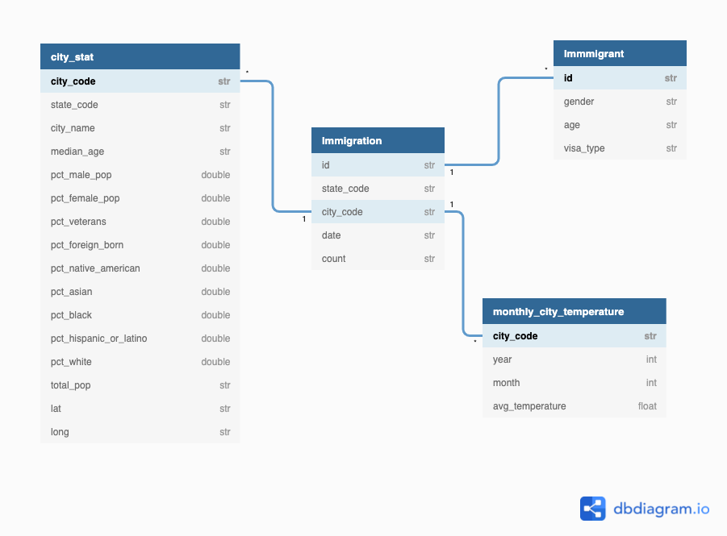

### Data Engineering Capstone Project

#### Project Summary

The objective of this project was to create an ETL pipeline for I94 immigration, global land temperatures, US demographics and aiport datasets to form an analytics database on immigration events. This analytics database could be useful for usecases such as studying the effects of temperature on the volume of travellers, how seasonality affects travel, the differences between people travelling from different climates, etc. 

Following are the datasets being used to create the ETL pipeline:

[I94 Immigration Data](https://travel.trade.gov/research/reports/i94/historical/2016.html): This data comes from the US National Tourism and Trade Office and includes the contents of the i94 form on entry to the united states. A data dictionary is included in the workspace.

[World Temperature Data](https://www.kaggle.com/berkeleyearth/climate-change-earth-surface-temperature-data): This dataset comes from Kaggle and includes the temperatures of various cities in the world from 1743 to 2013.

[U.S. City Demographic Data](https://public.opendatasoft.com/explore/dataset/us-cities-demographics/export): This data comes from OpenSoft. It contains information about the demographics of all US cities and census-designated places with a population greater or equal to 65,000 and comes from the US Census Bureau's 2015 American Community Survey.

[Airport Codes](https://datahub.io/core/airport-codes#data): This is a simple table of airport codes and corresponding cities.

The project follows the follow steps:
* Scope the Project and Gather Data
* Explore and Assess the Data
* Define the Data Model
* Run ETL to Model the Data
* Complete Project Write Up

The scope of this project is to create an ETL pipeline from four different data sources, create fact and dimensional tables, and be able to do different sorts of analysis on US immigration using factors of city, temperature, demographics. 

####  Conceptual Data Model

The data model to be used for this ETL is the star schema. It is simple, effective, will process quickly, and the joins will be simpler. 

Following are the staging and final tables used in the schema.

#### Staging Tables:
| table name   |  columns             |
| ------------ | ----------------    | 
| airports     | airport_name, type, country, state, gps_code, local_code, coordinates |
| immigration  | id, date, city_code, state_code, age, gender, visa_type, count |
| temperature  | year, month, city_code, avg_temperature, lat, long | 
| demographics | city_code, state_code, city_name, median_age, pcs_male_pop, pct_female_pop, pct_veterans, pct_foreign_born, pct_native_american, pct_asian, pct_black, pct_hispanic_or_latino, pct_white, total_pop |

#### Final Tables:
| table name | columns | type |
|-------------|----------|-----------|
| immigration_df | id, state_code, city_code, date, count | fact|
| immigrant_df | id, gender, age, visa_type | dimensional |
| city_stat_df | city_code, state_code, city_name, median_age, pct_male_pop, pct_female_pop, pct_veterans, pct_foreign_born, pct_native_american, pct_asian, pct_black, pct_hispanic_or_latino, pct_white, total_pop, lat, long | dimensional |
| monthly_city_temp | city_code, year, month, avg_temperature | dimensional | 

#### Mapping Out Data Pipelines
The steps necessary to pipeline the data into star schema model:
- Clean the data of nulls, duplicates, fix data_types
- Load the staging tables
- Create fact and dimensional tables
- Save the processed data into parquet files for further uses

#### Data Quality Checks
The data has to go thropugh quality checks are performed to ensure the pipeline ran as expected. These could include:
 * Integrity constraints on the relational database (e.g., unique key, data type, etc.)
 * Unit tests for the scripts to ensure they are doing the right thing
 * Source/Count checks to ensure completeness

 
 Brief description of data files with column names and their description, alng with an ER diagram

##### Fact Table

    immigration_df
        id: id
        state_code: state code of arrival city
        city_code: city port code of arrival city
        date: date of arrival
        count: count of immigrant's entries into the US

##### Dimensional Tables
   
    immigrant_df
        id: id of immigrant
        gender: gender of immigrant
        age: age of immigrant
        visa_type: immigrant's visa type

    city_stat_df
        city_code: city port code
        state_code: state code of the city
        city_name: name of the city
        median_age: median age of the city
        pct_male_pop: percentage of male population
        pct_female_pop: percentage of population in percentage
        pct_veterans: percentage of veteran population in percentage
        pct_foreign_born: percentage of foreign born population
        pct_native_american: percentage of native american population
        pct_asian: percentage of asian population
        pct_black: percentage of black population
        pct_hispanic_or_latino: percentage of hispanic population
        pct_white: percentage of white population
        total_pop: city's total population
        lat: latitude of the city
        long: longitude of the city

    monthly_city_temp_df
        city_code: city port code
        year: 
        month: month 
        avg_temperature: average temperature of city for given month
        
### Some interesting facts

* The rationale for choosing Apache Spark:
     - ability to handle multiple file formats with large datasets
     - unified analytics engine for big data
     - easy processing of large input files into dataframes
     - easy manipulation of data 

* The decision for how often the data should be updated must be based on factors such as how often new data will be available, and what kind of analytics will be performed. For these datasets, a monthly update cycle might be optimal.

* If the data was increased by 100x volume, the data would be stored in something like Amazon S3 bucket and loaded onto the staging tables. Spark would still be used as the data processing framework as it is able to handle very large datadets. 

* If the data populates a dashboard that must be updated on a daily basis by 7am every day, a workflow management platform would have to be used such as Apache Airflow, where data pipelines could be built, scheduled and automated. Data quality checks can also be scheduled. 

* If the database needed to be accessed by 100+ people, the analytics database would have to be moved to a proudction scale warehouse on the cloud such as Amazon Redshift that would allow efficient access of the database by many people. It also has auto-scaling capabilities and great read performance.
